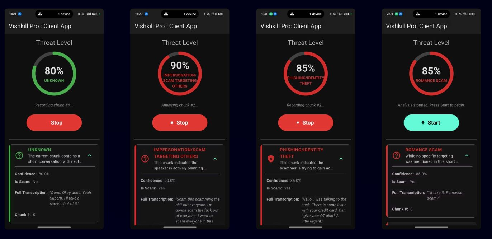

# VishKill Pro

**Real-time voice phishing (vishing) detection using multi-modal AI analysis.**

2nd Runners-Up -- Inter-NIT Hackathon on Cyber Security 2025, NIT Bhopal (Central Bank of India)



## What It Does

VishKill Pro analyzes VoIP calls in near-real-time to detect scam calls **before** damage is done. It combines five AI models into a single pipeline:

| Layer | Model | Purpose |
|-------|-------|---------|
| Deepfake Detection | [Deepfake-audio-detection-V2](https://huggingface.co/as1605/Deepfake-audio-detection-V2) | Detect AI-cloned/synthetic voices |
| Background Noise | [YAMNet](https://tfhub.dev/google/yamnet/1) (521 AudioSet classes) | Verify if caller is actually in a bank/office |
| Speaker Diarization | [pyannote/speaker-diarization-3.1](https://huggingface.co/pyannote/speaker-diarization-3.1) | Separate and identify speakers |
| Emotion Detection | [wav2vec2-emotion-recognition](https://huggingface.co/Dpngtm/wav2vec2-emotion-recognition) | Detect emotional manipulation per speaker |
| Transcription + LLM | [OpenAI Whisper](https://github.com/openai/whisper) + [Hermes 3 8B](https://huggingface.co/NousResearch/Hermes-3-Llama-3.1-8B) | Transcribe speech, reason about scam patterns |

## How It Works

```
Flutter VoIP App ──> Records call ──> Uploads to Signaling Server
                                              │
                                              ▼
                                     FastAPI Backend (GPU)
                                              │
                    ┌─────────────────────────┼─────────────────────────┐
                    │                         │                         │
              ┌─────▼─────┐           ┌───────▼───────┐         ┌──────▼──────┐
              │  BATCH 1   │           │   BATCH 2     │         │  BATCH 3    │
              │ (parallel) │           │  (parallel)   │         │             │
              ├────────────┤           ├───────────────┤         ├─────────────┤
              │ Deepfake   │           │ Emotion       │         │ Hermes 3 8B │
              │ YAMNet     │  ──then── │ detection per │ ──then──│ LLM reasons │
              │ Diarize    │           │ speaker       │         │ over all    │
              │ Whisper    │           │ segment       │         │ evidence    │
              └────────────┘           └───────────────┘         └──────┬──────┘
                                                                       │
                                                                       ▼
                                                              JSON result:
                                                              scam/not-scam,
                                                              confidence,
                                                              reasoning
```

Models are loaded one batch at a time and unloaded between batches to fit on a single GPU.

## Project Structure

```
.
├── backend/                    # Python AI/ML pipeline
│   ├── api.py                  # FastAPI REST endpoints
│   ├── main.py                 # Core analysis pipeline (3-batch GPU orchestration)
│   ├── ai_voice_detector.py    # Deepfake audio detection
│   ├── emotion_detection.py    # Per-segment emotion classification
│   ├── audio_diarization.py    # Speaker diarization + audio splitting
│   ├── background_noise.py     # Office environment verification (YAMNet)
│   ├── scanner.py              # File-watching scanner with rule-based fallback
│   ├── Dockerfile              # NVIDIA CUDA 12.4 container
│   ├── requirements.txt        # Python dependencies (CUDA 12.1)
│   └── requirements_cuda124.txt
│
├── voip/                       # Flutter mobile app + signaling server
│   ├── lib/
│   │   ├── main.dart           # Dialer UI, auto server discovery, call screens
│   │   └── voip_service.dart   # WebRTC service, recording, upload
│   ├── signaling_server/
│   │   ├── server.js           # Node.js + Socket.IO + recording upload
│   │   ├── Dockerfile
│   │   └── package.json
│   └── pubspec.yaml
│
├── demo/
│   ├── sample_output.json          # Example analysis result
│   ├── app_screenshot.jpeg         # App UI screenshots
│   └── VishKill_Pro_Presentation.pdf
│
├── docker-compose.yml          # Full stack: backend (GPU) + signaling server
├── .env.example                # Required environment variables
└── README.md
```

## Quick Start

### Prerequisites

- NVIDIA GPU with CUDA 12.4 + [NVIDIA Container Toolkit](https://docs.nvidia.com/datacenter/cloud-native/container-toolkit/install-guide.html)
- Docker and Docker Compose
- [Ollama](https://ollama.ai) with `hermes3:8b` model
- HuggingFace token (for pyannote speaker diarization)

### 1. Set up environment

```bash
cp .env.example .env
# Edit .env and add your HuggingFace token
```

### 2. Pull the LLM

```bash
ollama pull hermes3:8b
```

### 3. Start the services

```bash
mkdir -p recordings results
docker-compose up --build
```

This starts:
- **Backend API** on port `8000` (FastAPI + GPU analysis)
- **Signaling Server** on port `3000` (receives uploads, triggers analysis)

### 4. Test with an audio file

```bash
# Upload an audio file for analysis
curl -X POST -F "recording=@path/to/audio.wav" http://localhost:3000/upload-recording

# Or upload directly to the backend
curl -X POST -F "file=@path/to/audio.wav" http://localhost:8000/analyze-audio

# View results
curl http://localhost:8000/analysis-results
```

### 5. Run the Flutter app (optional)

```bash
cd voip
flutter pub get
flutter run
```

The app auto-discovers the signaling server on the local network.

## API Endpoints

| Method | Endpoint | Description |
|--------|----------|-------------|
| `POST` | `/analyze-audio` | Upload audio file, get scam analysis |
| `POST` | `/force-analyze/{filename}` | Analyze a file already in `recordings/` |
| `GET`  | `/analysis-results` | List all analysis results |
| `GET`  | `/voip-status` | Backend health check |

## Example Output

```json
{
  "file_name": "recording_1719838861_chunk.wav",
  "processing_time": 14.2,
  "scam": true,
  "confidence_score": 0.85,
  "reasoning": "Voice cloning detected with high confidence. Caller claims to be from bank but background noise inconsistent with office environment. Emotional manipulation pattern: caller maintains calm tone while using urgent language to create fear.",
  "is_cloned": false,
  "clone_confidence": 0.34,
  "noise": {
    "is_office": false,
    "confidence": 0.78,
    "composite_score": 0.22,
    "detected_tags": ["Speech", "Traffic noise"],
    "strong_signal": false
  },
  "diarization": [
    {"speaker": "SPEAKER_00", "start": 0.0, "end": 5.2, "duration": 5.2},
    {"speaker": "SPEAKER_01", "start": 5.2, "end": 10.0, "duration": 4.8}
  ],
  "emotions": [
    {"top_emotion": "neutral", "scores": {"neutral": 0.82, "calm": 0.11}},
    {"top_emotion": "fearful", "scores": {"fearful": 0.65, "sad": 0.20}}
  ],
  "transcript": "This is your bank calling about suspicious activity on your account. You need to verify your identity immediately or your account will be suspended."
}
```

## Architecture Details

### GPU Memory Carousel

The system runs 6 large models on a single GPU by loading them in sequential batches:

1. **Batch 1** (parallel): Deepfake detector + YAMNet + Diarization + Whisper
2. GPU memory cleared (torch.cuda.empty_cache + gc.collect)
3. **Batch 2** (parallel): Emotion detection on each speaker segment
4. GPU memory cleared
5. **Batch 3**: Hermes 3 8B via Ollama subprocess (killed immediately after inference)

### Key Design Decisions

- **Whisper `task="translate"`**: Translates any language to English, enabling cross-lingual scam detection
- **Per-speaker emotion profiling**: Detects asymmetric manipulation (scammer calm, victim fearful)
- **Background environment authentication**: YAMNet verifies if caller's claimed location matches actual audio
- **LLM as evidence synthesizer**: Hermes 3 reasons over all model outputs rather than being the primary detector
- **Privacy-first**: All processing local, no external API calls, audio deleted after analysis

## References

1. `as1605/Deepfake-audio-detection-V2` -- HuggingFace
2. "Generalized Source Tracing: Detecting Novel Audio Deepfake Algorithm" -- arXiv:2406.03240
3. "Deepfake Audio Detection Using Spectrogram-based Feature and Ensemble of Deep Learning Models" -- arXiv:2407.01777
4. "Detecting Voice Phishing with Precision: Fine-Tuning Small Language Models" -- arXiv:2506.06180
5. YAMNet -- TensorFlow Hub (Google AudioSet)
6. pyannote-audio 3.1 -- Speaker Diarization
7. OpenAI Whisper -- Speech Recognition
8. NousResearch Hermes 3 -- LLM
